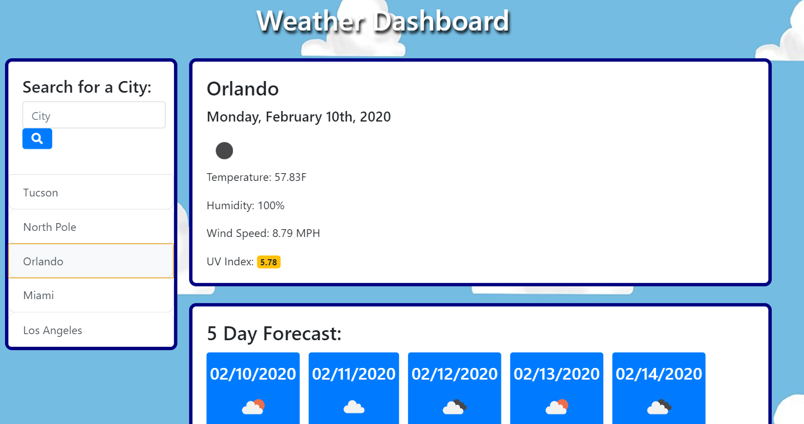
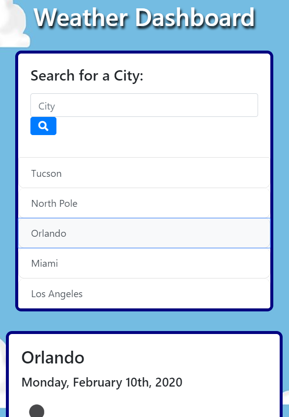

# WeatherDashboard
This application will display the current weather and five day forecast for any given city.

## Description
This weather application checks to see if there are any cities in local storage and populate those buttons under the search input. Upon clicking these buttons, the respective city's weather data will be rendered, as well as the 5 day forecast. The user can also input the name of the city and the search will retrieve weather data and forecast, as well as prepend a new button and store the city in the local storage. 

The UV Index badge will display green for favorable conditions, yellow for moderate conditions, and red for severe conditions.

All information is retrieved using the OpenWeatherMap API. 
https://openweathermap.org/

### Visuals

#### Installation
No installation necessary. The program is ready to run.

https://alexjoeldelgado.github.io/WeatherDashboard/

##### Licenses
No licenses necessary. Feel free to use my code.

###### Author
Alexander Delgado
